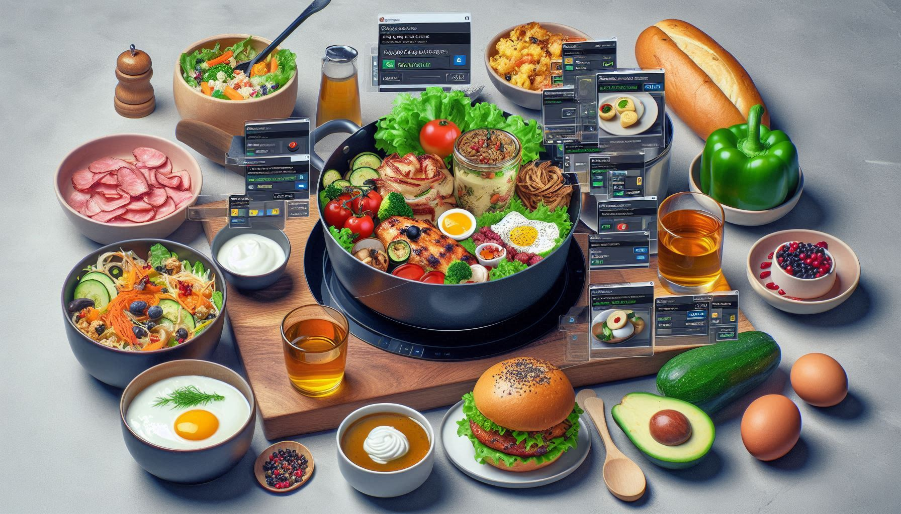

# 🍳 AI-Powered Recipe Generator

An intelligent cooking assistant that transforms food images into detailed recipes with audio instructions. This project leverages state-of-the-art AI models from Hugging Face and OpenAI to provide a seamless cooking experience from visual recognition to step-by-step audio guidance.

## ✨ Features

### 🖼️ **Image Recognition & Captioning**
- **BLIP Model Integration** - Uses Salesforce's blip-image-captioning-base model for accurate food dish identification.
- **Flexible Image Input** - Supports image URLs and various image formats.
- **Smart Food Description** - Generates detailed captions describing the dish, cooking style and visual characteristics.

### 🤖 **AI-Powered Recipe Generation**
- **GPT-3.5 Turbo Integration** - Leverages OpenAI's gpt-3.5-turbo-1106 model for comprehensive recipe creation.
- **Contextual Recipe Creation** - Generates ingredients lists and step-by-step instructions based on image captions.
- **Professional Chef Prompting** - Uses carefully crafted prompts to ensure high-quality, detailed recipes.

### 🎵 **Text-to-Speech Conversion**
- **Google TTS Integration** - Converts generated recipes into clear audio using gtts library.
- **Hands-free Cooking** - Listen to instructions while your hands are busy in the kitchen.
- **Customizable Audio** - Adjustable language and speech speed settings.

## 🛠️ Technology Stack

| Component | Technology | Purpose |
|-----------|------------|---------|
| **Image Captioning** | Salesforce BLIP | Food image analysis and description |
| **Recipe Generation** | OpenAI GPT-3.5 Turbo | Intelligent recipe creation |
| **AI Orchestration** | LangChain | Prompt engineering and model chaining |
| **Text-to-Speech** | Google TTS | Audio instruction generation |
| **Image Processing** | PIL/Pillow | Image handling and manipulation |
| **Model Loading** | Transformers | Hugging Face model integration |

## 🚀 Quick Start

### 1. **Environment Setup**
Install the required dependencies for machine learning models, AI orchestration and audio processing libraries.

### 2. **API Key Configuration**
- Obtain an OpenAI API key from the OpenAI Platform
- Store securely in environment variables or Google Colab secrets
- Optionally create a Hugging Face account for model access

### 3. **Authentication**
Authenticate with Hugging Face for seamless model downloads and usage.

## 💻 How It Works

### **4-Step Process**
1. **Image Loading** - Load and process food images from URLs or local files
2. **Image Captioning** - Generate descriptive captions using AI vision models
3. **Recipe Generation** - Create detailed recipes using advanced language models
4. **Audio Synthesis** - Convert text recipes into spoken audio instructions

### **Complete Workflow**
The system processes any food image through a seamless pipeline that identifies the dish, understands its characteristics, generates a comprehensive recipe with ingredients and instructions and creates an audio version for hands-free cooking assistance.

## 🔧 Configuration Options

### **Model Parameters**
- **Temperature Control** - Adjust creativity level in recipe generation (0-1 scale)
- **Response Length** - Control the detail level of generated recipes
- **Model Selection** - Choose between different AI models for various tasks

### **Audio Settings**
- **Language Selection** - Generate audio in different languages
- **Speech Speed** - Adjust playback speed for comfortable listening
- **Voice Quality** - High-quality text-to-speech synthesis

### **Prompt Customization**
Customize the AI prompts to generate recipes with specific requirements like cooking time, serving size, dietary restrictions or cooking skill level.

## 📊 Technical Specifications

### **Performance Metrics**
- **Image Processing** - 2-4 seconds per image
- **Recipe Generation** - 5-15 seconds depending on complexity
- **Audio Generation** - 2-5 seconds for average recipe
- **Total Pipeline** - 10-25 seconds end-to-end

### **Model Details**
- **Image Captioning** - Salesforce BLIP (590M parameters)
- **Text Generation** - GPT-3.5 Turbo (175B parameters)
- **Audio Synthesis** - Google Text-to-Speech API

### **Resource Requirements**
- **RAM** - Minimum 4GB (8GB recommended)
- **Storage** - ~2GB for model downloads
- **Internet** - Required for API calls and model downloads

## 🔑 API Keys & Authentication

### **Required API Keys**
1. **OpenAI API Key**: 
   - Sign up at OpenAI Platform
   - Generate API key from dashboard
   - Store securely in environment variables

2. **Hugging Face Token** (Optional but recommended):
   - Create account at Hugging Face
   - Generate access token for model access

### **Security Best Practices**
- Never hardcode API keys in your files
- Use environment variables or secure secret management
- For Google Colab, use the built-in secrets feature

## 🔮 Future Enhancements

- [ ] **Local Model Support** - Run models locally without API dependencies
- [ ] **Multi-language Support** - Generate recipes in multiple languages
- [ ] **Nutritional Analysis** - Add calorie and nutrient information
- [ ] **Dietary Restrictions** - Filter recipes based on dietary needs (vegan, gluten-free, etc.)
- [ ] **Cooking Video Integration** - Generate cooking tutorial videos
- [ ] **Recipe Rating System** - Community feedback and recipe improvements
- [ ] **Mobile App** - Cross-platform mobile application
- [ ] **Voice Commands** - Voice input for hands-free operation

